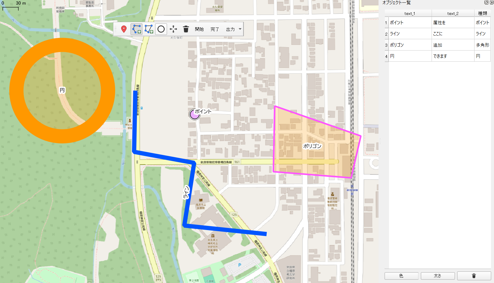

# 重要な操作/Important operation

インストール後、レイヤパネルに表示される"グループ描画"をクリックし、ツールバーの"開始"をクリックしてください。この操作によりオブジェクトの追加が可能になります。

Important operation: After installation, click “グループ描画” displayed in the Layers panel, then click “開始” on the toolbar.This operation enables you to add objects.

# QuickDrawJP
QuickDrawJP is a QGIS plugin that lets you draw points, lines, polygons and circles directly on a map **as if sketching on paper**.  
It was originally developed to support community health assessment and disaster response activities by Public Health Nurses (PHNs) in Japan, but is useful for any quick sketching and annotation workflow in QGIS.

-©OpenStreetMap Contributors
---

## Features

- Draw **points**, **lines**, **polygons** and **circles** on a QGIS map as if you were drawing.
- Change **color** and **line width** with intuitive buttons.
- Add and edit **labels** using `text_1` and `text_2`.
- Automatically store:
  - Latitude / longitude of objects
  - Line **length**
  - Polygon **area**
  - Circle **radius** and related attributes
- Manage all drawn objects in a convenient **object list** dock.
  - Edit `text_1` / `text_2` directly from the table and sync with feature attributes.
- Export all objects at once as **FlatGeobuf**.
- Capture the current map window as a **PNG screenshot** with one click.

QuickDrawJP is particularly designed for:

- Community health assessment by **Public Health Nurses (PHNs)**  
- **Disaster response** and field sketching  
- General quick annotations during GIS-based discussions and teaching

---

## 日本語の説明

QuickDrawJP は、QGIS 上でまるで絵を描くように **ポイント・ライン・多角形・円** を追加できるプラグインです。  
色や線の太さはボタンから直感的に変更でき、`text_1` と `text_2` によるラベルの追加・編集も可能です。

描画したオブジェクトについて、次のような情報を自動で取得します。

- 緯度・経度
- ラインの距離
- 多角形の面積
- 円の半径 など

これらのオブジェクトは「オブジェクト一覧」パネルで一覧表示され、  
`text_1` / `text_2` を表上で編集すると、対応するフィーチャの属性テーブルにも自動で反映されます。

さらに、

- すべてのオブジェクトを **FlatGeobuf** として一括出力
- 画面の **スクリーンショット（PNG）** をワンクリックで保存

といった機能も備えています。

本プラグインは、保健師（Public Health Nurse）の **地域診断** や  
**災害時保健師活動** の支援を目的として開発しましたが、  
GIS を用いた教育・ワークショップ・会議中の簡易な説明図作成など、  
幅広い場面で活用できます。

---

## Installation

### From QGIS Official Plugin Repository (recommended)

1. Open **QGIS**.
2. Go to **Plugins → Manage and Install Plugins…**.
3. Search for **“QuickDrawJP”**.
4. Click **Install Plugin**.

### From ZIP file (manual install)

1. Download the latest release ZIP from the [GitHub Releases](https://github.com/GISPHN/QuickDrawJP/releases) page.
2. In QGIS, open **Plugins → Manage and Install Plugins… → Install from ZIP**.
3. Select the downloaded ZIP file and click **Install Plugin**.

---

## Usage

1. Enable the plugin and show the **QuickDrawJP toolbar**.
2. Choose a drawing mode:
   - **Point** – add point markers
   - **Line** – draw lines and routes
   - **Polygon** – draw arbitrary polygons
   - **Circle** – draw circles with radius
3. Use the **color** and **width** buttons to set style.
4. Use **Start / Finish** buttons to control a drawing session if needed.
5. Open the **object list dock** to:
   - See all objects with `text_1`, `text_2` and type
   - Edit labels directly in the table
   - Select and delete objects
6. Export all objects as **FlatGeobuf** or capture the current map as a **PNG** from the toolbar.

---

## License

This plugin is released under the **MIT License**.  
See the [`LICENSE`](LICENSE) file for details.

---

## Author

- **GISPHN (Ryo Horiike)**  
  - GitHub: [@GISPHN](https://github.com/GISPHN)  
  - Email: [ryo.horiike@naramed-u.ac.jp](mailto:ryo.horiike@naramed-u.ac.jp)

QuickDrawJP was developed as part of research and practice on GIS-based community health assessment and disaster response by Public Health Nurses.
